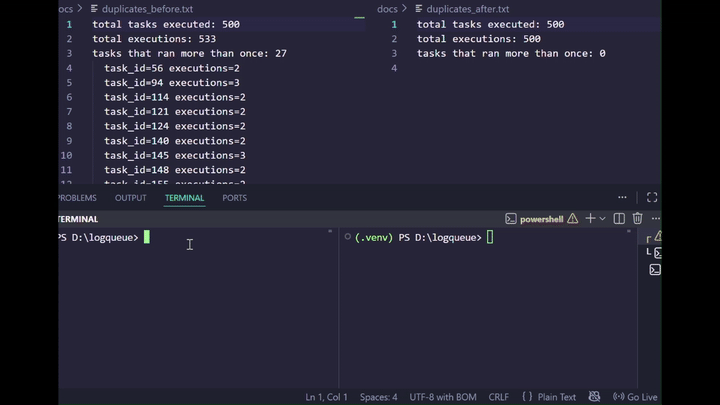
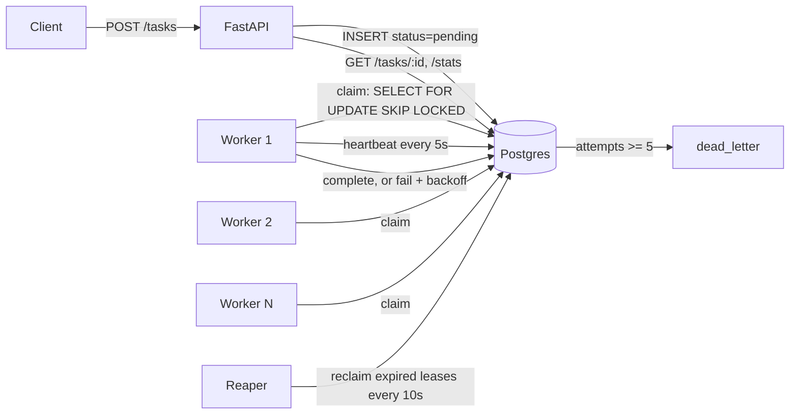

# logqueue

A fault-tolerant, Postgres-backed task queue that survives worker crashes without losing or double-processing work.

[](https://github.com/pari23367/logqueue/actions/workflows/ci.yml)



Four workers processing tasks; one is killed mid-task and the reaper reclaims its work 30 seconds later.

**Live**: https://logqueue.onrender.com — free tier, so the first request after a period of inactivity takes about 50 seconds to cold start.

## Why I built this

I wanted to understand how job queues guarantee work isn't lost, so I built one and proved it under failure — a real race condition, reproduced and fixed; a real crash, recovered; a real chaos run with workers actually killed mid-task.

## Architecture



Workers run either as separate processes (`docker compose up`, `WORKER_MODE=standalone`) or as threads inside the API process (`WORKER_MODE=embedded`, used in production on Render's single free web service).

## The race condition

The first working version claimed tasks with a plain `SELECT` followed by a separate `UPDATE`. With multiple workers polling concurrently, two workers could both `SELECT` the same pending task before either one's `UPDATE` committed — both would believe they owned it and both would process it.

Reproduced with 4 workers racing on 500 seeded tasks:

```
total tasks executed: 500
total executions: 533
tasks that ran more than once: 27
```

Fixed by claiming with a single atomic statement:

```sql
WITH next AS (
    SELECT id FROM tasks
    WHERE status = 'pending' AND run_after <= now()
    ORDER BY created_at
    LIMIT 1
    FOR UPDATE SKIP LOCKED
)
UPDATE tasks
SET status = 'in_progress', locked_by = %s, locked_at = now()
FROM next
WHERE tasks.id = next.id
RETURNING tasks.id, tasks.payload
```

`FOR UPDATE` locks the candidate row at selection time, inside the same statement that claims it — there's no longer a gap between "decide which row" and "mark it taken" for a second worker to land in. `SKIP LOCKED` matters just as much as the lock itself: without it, a worker contending for an already-locked row would block and wait, and Postgres re-evaluates the row's `WHERE` clause after the wait — since the row is no longer `pending` by then, the query can return zero rows even though other genuinely pending tasks exist untouched. `SKIP LOCKED` skips straight past a locked row to the next available one instead, so N workers actually claim N different rows in parallel rather than queueing single-file behind whichever row happened to be selected first.

Same 4-worker, 500-task setup after the fix:

```
total tasks executed: 500
total executions: 500
tasks that ran more than once: 0
```

## Crash recovery

Every claim starts a heartbeat thread that refreshes `locked_at` every 5 seconds for as long as the worker is alive and holding the task. A separate reaper process sweeps every 10 seconds for tasks still `in_progress` with a `locked_at` older than 30 seconds — evidence the worker that claimed them is dead, since a live one would have refreshed it — and puts them back to `pending` with `attempts` incremented and the lease cleared.

Proven by killing a worker mid-task (`docker kill`) and watching what happened to the task it was holding.

Before — orphaned, owned by a worker that no longer exists:

```
 id  |   status    |       locked_by       |           locked_at           | attempts
-----+-------------+-----------------------+-------------------------------+----------
 577 | in_progress | c9ad99536662-690474f8 | 2026-07-23 16:17:29.995964+00 |        0
```

After — reclaimed by the reaper, then claimed and finished by a different, live worker:

```
 id  |  status   |       locked_by       |           locked_at           | attempts |          run_after
-----+-----------+-----------------------+-------------------------------+----------+------------------------------
 577 | completed | a6aa190a1ae5-165cc65b | 2026-07-23 16:22:48.048363+00 |        1 | 2026-07-23 16:22:47.78615+00
```

## Chaos test

`scripts/chaos.py` enqueues a batch of tasks, then for 90 seconds repeatedly picks a random worker container, `docker kill`s it, and brings it back with `docker compose up -d` — a real process getting SIGKILLed mid-task, not a simulated failure.

1000 tasks, 12 workers killed over the 90-second run:

```
total tasks              1000
completed                1000
dead_letter              0
total executions         1010
tasks that needed retry  10
duplicate executions     0
stuck in_progress        0
workers killed           12
```

Every task that survived a kill got reclaimed by the reaper and finished by a different worker — that's the 10 tasks that needed a retry, and why total executions (1010) is higher than total tasks (1000). Zero tasks were lost, and zero showed an execution count the retry/reclaim history couldn't account for — full transcript in `docs/chaos_results.txt`.

## Benchmarks

Sustained throughput and enqueue-to-first-claim latency across worker counts, 200 tasks per run:

| Workers | Throughput (tasks/sec) | p50 latency (s) | p95 latency (s) | p99 latency (s) |
|---|---|---|---|---|
| 1 | 3.09 | 28.999 | 58.436 | 60.403 |
| 2 | 6.62 | 13.540 | 26.618 | 27.606 |
| 4 | 12.66 | 6.591 | 12.556 | 13.082 |
| 8 | 23.57 | 3.161 | 5.229 | 5.482 |

The high latency at 1 worker (p50 29s, p99 60s) is queue backlog, not claim overhead: 200 tasks land in the queue almost simultaneously, and with one worker processing sequentially at roughly 0.1-0.5s per task, tasks near the back of the batch simply wait a long time for their turn. Throughput scales close to linearly with worker count, as expected for I/O-bound work with no lock contention between workers claiming different rows.

## Quickstart

```bash
cp .env.example .env
docker compose up -d --build
```

The API is then available at `http://localhost:8000`.

### Reproduce the headline result

Four commands to see the exactly-once claim and crash recovery for yourself, end to end:

```bash
docker compose up -d --build --scale worker=4
python seed.py 500
docker compose run --rm api python scripts/check_duplicates.py
python scripts/chaos.py
```

The first seeds and processes 500 tasks with 4 workers racing on the queue; `check_duplicates.py` confirms `total executions == total tasks` — zero duplicates, the fix from [The race condition](#the-race-condition) holding under real concurrency. `chaos.py` then enqueues its own batch and spends 90 seconds `docker kill`-ing random workers mid-task, ending with the same assertion this README's [Chaos test](#chaos-test) numbers came from: every task lands in `completed` or `dead_letter`, none stuck, none unaccounted for. `chaos.py` runs on the host (not in a container, since it needs to kill and restart containers itself), so it needs `requests` and `psycopg` installed locally: `pip install -r requirements.txt`.

## Design decisions

Full reasoning in [`DECISIONS.md`](DECISIONS.md). Highlights:

- **`jsonb` for `payload`**, not `text` — the worker reads and updates fields on it (e.g. merging in the parsed result), which needs Postgres to understand the structure rather than treating it as an opaque blob.
- **`run_after`** is what makes exponential backoff possible without a separate scheduler: a failed task goes back to `pending` with `run_after` pushed into the future instead of being immediately reclaimable.
- **A partial index** (`WHERE status = 'pending'`) backs the claim query — it only indexes the subset of rows the claim query actually scans, and stays small as completed/dead-lettered rows accumulate.
- **`locked_by` and `locked_at` are separate columns** because they serve different consumers: the reaper's expiry check only ever needs the timestamp, and `locked_by` exists purely for attribution when a lease goes stale.
- **Postgres, not Redis Streams or Kafka.** Redis Streams or Kafka would be the production choice for a real workload; I implemented claiming on Postgres to understand the delivery semantics directly — `FOR UPDATE SKIP LOCKED`, lease expiry, exactly-once accounting — rather than getting them for free from a message broker.

## What I'd add next

- **Prometheus metrics** — queue depth, claim latency, retry/DLQ rates as real time series instead of point-in-time `/stats` snapshots.
- **Priority scheduling** — a priority column in the claim query's `ORDER BY`, so urgent work doesn't wait behind a large backlog of routine tasks.
- **Partitioning** — `tasks` and `task_executions` will both grow unbounded; partitioning by `created_at` would keep the claim query's index small and make old data easy to drop.
